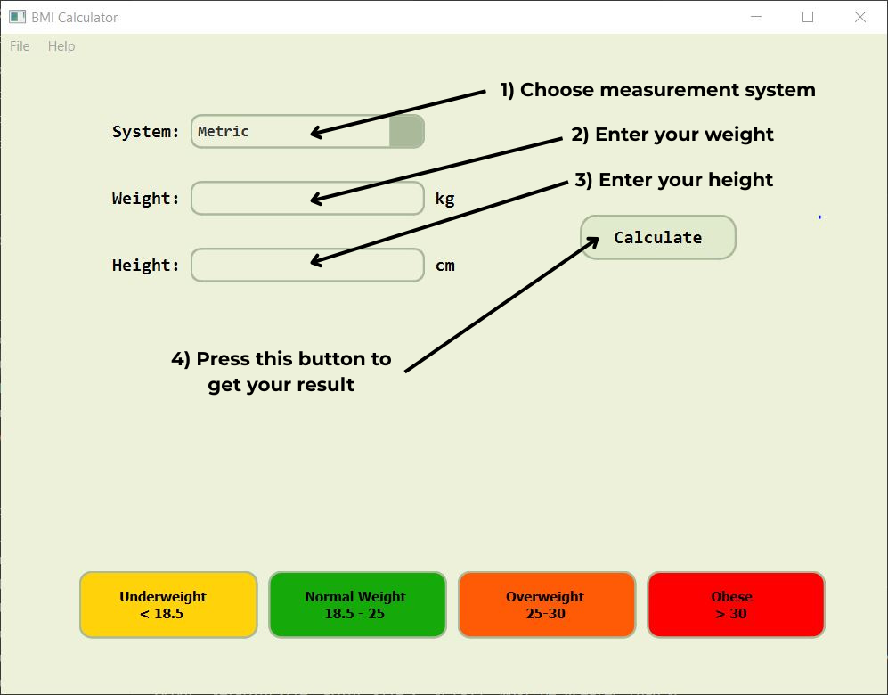
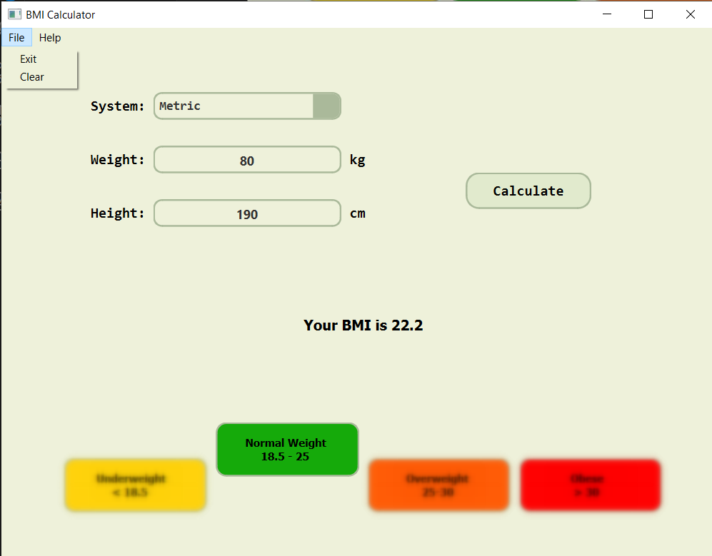

# GUI BMI Calculator

Simple BMI calculator with graphical user interface built on Python, using Pyqt6 module and qt designer.

## Installation
1. Clone the repository:
    ```bash
    git clone https://github.com/kd0nwww/GUI_BMI_calculator.git
    ```
2. Navigate to the project directory:
    ```bash
    cd GUI_BMI_calculator
    ```
3. Download all required modules:
    ```bash
    pip install -r requirements.txt
    ```

## Usage

### **Instructions:**


### **Result:**


### **Additional functionality:**

### **This menu at the top left corner gives you 2 options:**
- 1) **'Exit': which simply stops the program.**
- 2) **'Clear': which empties weight and height input fields and remove blur effects from result labels.**
