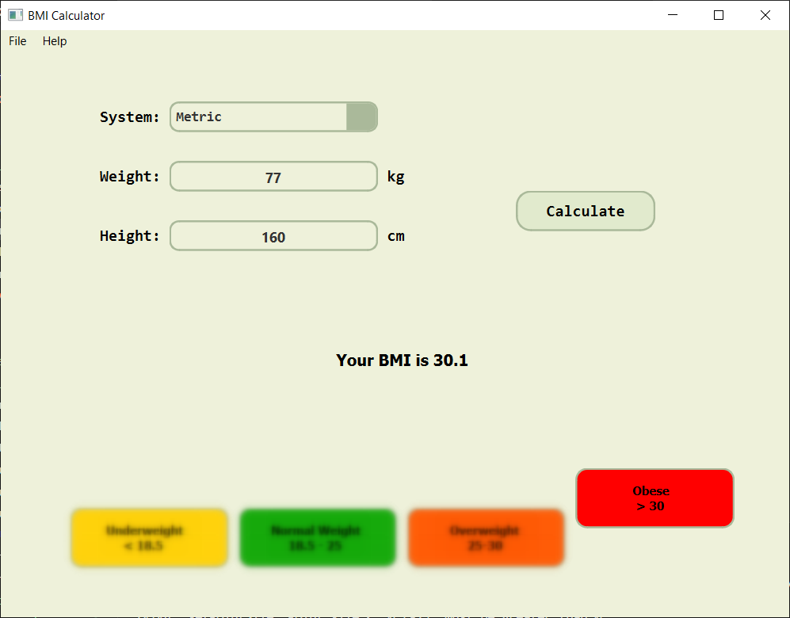
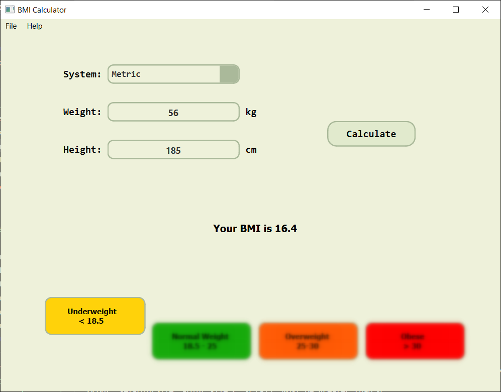
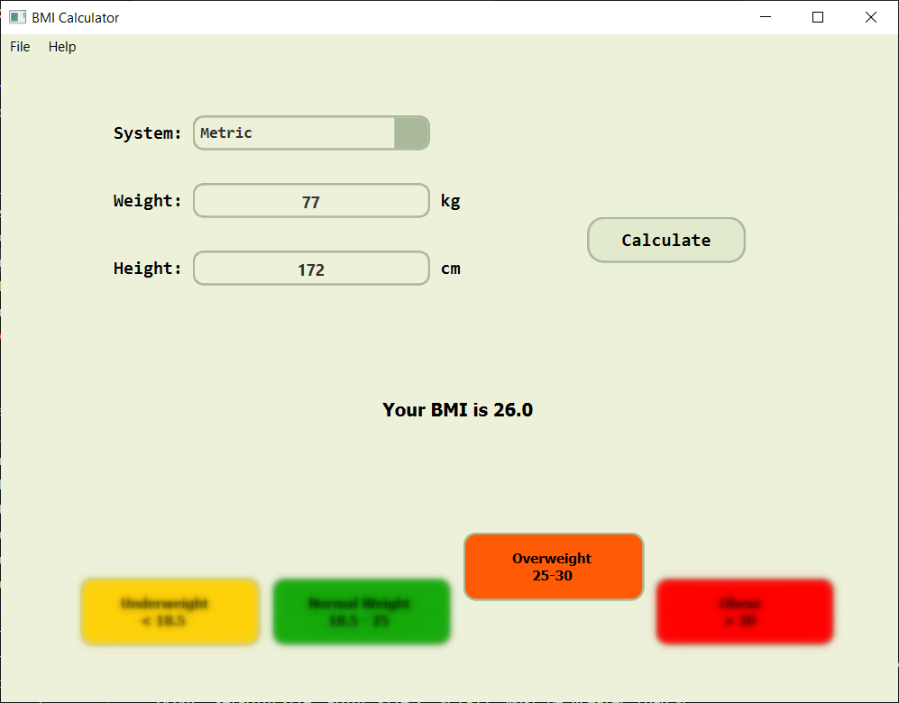
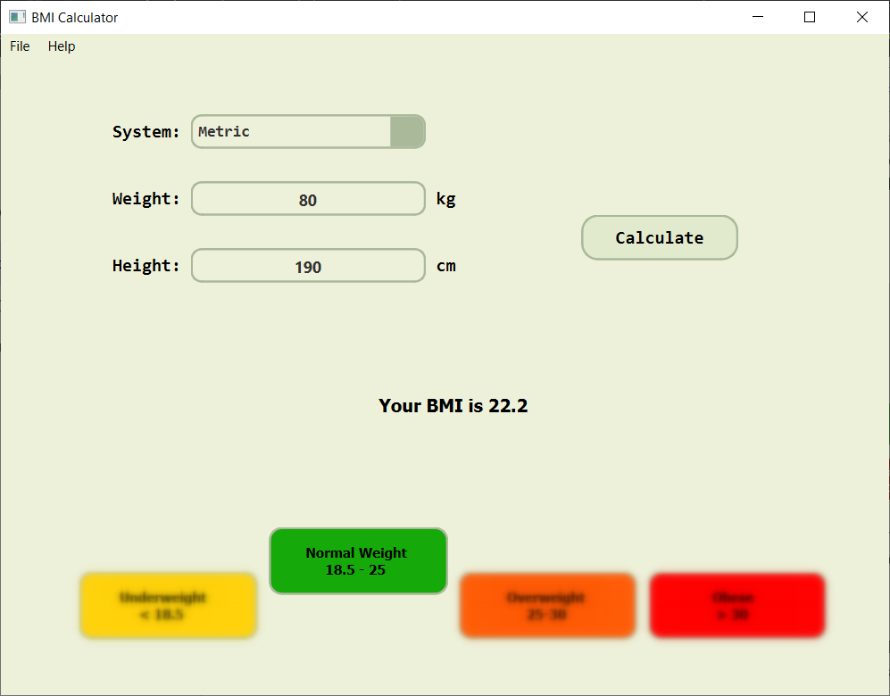

# GUI BMI Calculator

Simple BMI calculator with graphical user interface built on Python, using Pyqt6 module and qt designer.

## Structure
- [screenshots](screenshots) - the directory with screenshot of program
- [design.py](design.py) - the GUI produced with qt designer
- [main.py](main.py) - the main loop of the program
- [requirements.txt](requirements.txt) - file with required modules and their versions
- [window.py](window.py) - file contains class that extends `PyQt6.QtWidgets.QMainWindow` and uses the GUI from [design.py](design.py)

## Window class

Inherits from `PyQt6.QtWidgets.QMainWindow`, and represents the main window of the program.

**Methods**
- `initUI()` - Adjusts the size of the window, sets title, and binds buttons in the program to functions.
-  `calculate_bmi()` - Takes weight and height from input fields and calculates BMI. It is aslo resposible for blur, and moving effects.
- `change_units()` - Changes kg/cm into lbs/in.
- `clear()` - Empties input fields and removes all graphical effects.

## Some examples





## Installation
1. Clone the repository:
    ```bash
    git clone https://github.com/kd0nwww/GUI_BMI_calculator.git
    ```
2. Navigate to the project directory:
    ```bash
    cd GUI_BMI_calculator
    ```
3. Download all required modules:
    ```bash
    pip install -r requirements.txt
    ```

## Usage

Run the main file:
```bash
python main.py
```

### **Instructions:**


### **Result:**


### **Additional functionality:**

### **This menu at the top left corner gives you 2 options:**
- **'Exit': which simply stops the program.**
- **'Clear': which empties weight and height input fields and remove blur effects from result labels.**

> [!WARNING]
> Please use only 'Clear' button at the top left corner to clear input fields.
